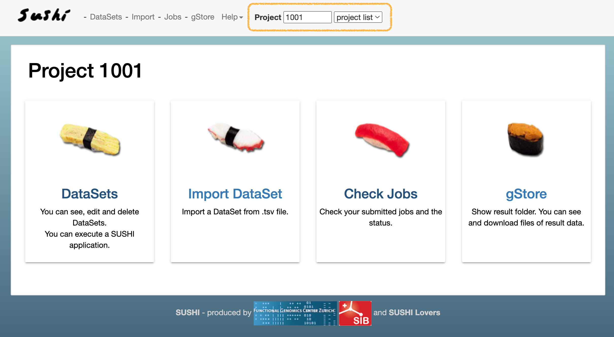
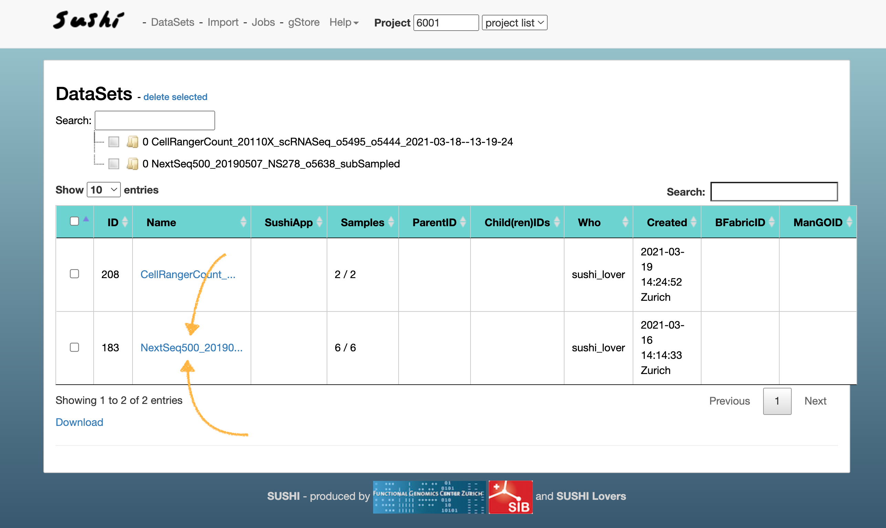
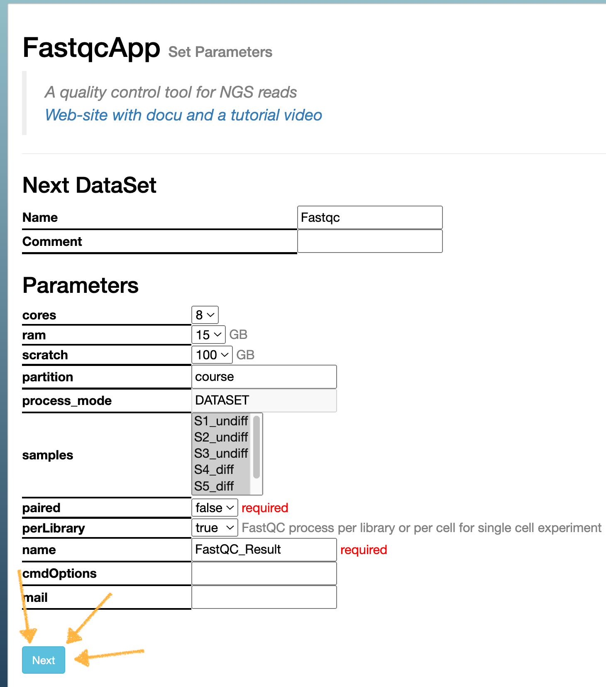
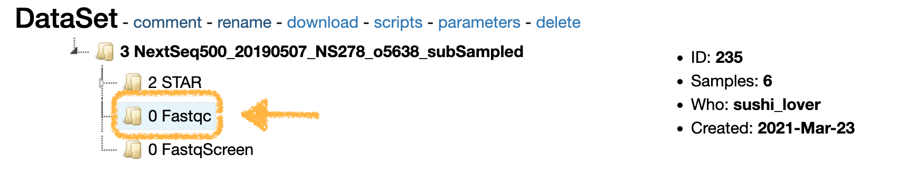

# Exercise 1 - ReadQC
- Author: FGCZ
- Date: 26/04/2024

Steps
1. [Navigate to SUSHI Course Server](#1-navigate-to-sushi-course-server-httpsfgcz-course1bfabricorg)
2. [Select your project ID](#2-enter-your-project-id-in-the-field-or-select-your-project-id-in-the-selection-box-eg-1001-1002--etc)
3. [Select DataSets](#3-select-datasets-to-see-the-list-of-existing-datasets-under-this-sushi-project)
4. [Check DataSet](#4-click-on-the-name-of-the-dataset-to-be-taken-to-that-dataset-page-on-sushi)
5. [Confirm parameters](#5-keep-the-default-options-click-next)
6. [Submit the job](#6-submit-the-job)
7. [Return to the dataset main page](#7-return-to-the-dataset-main-page)
8. [Navigate to the FastQC dataset](#8-navigate-to-the-fastqc-dataset)
9. [Explore the FastQC and MultiQC reports](#9-explore-the-fastqc-and-multiqc-reports)
10. [Questions](#10-questions)

----

### 1. Navigate to SUSHI Course Server: https://fgcz-course1.bfabric.org

### 2. Enter your project ID in the field, or select your project ID in the selection box, *e.g.*, 1001, 1002 ..., *etc*.

### 3. Select "DataSets" to see the list of existing datasets under this SUSHI project 

There should be two datasets, one for bulk RNA and another for variant calling

### 4. Click on the name of the dataset to be taken to that dataset page on SUSHI 

See the list of apps available for this dataset, select `FastqcApp`

### 5. Keep the default options, click "Next" 

### 6. Submit the job 

### 7. Return to the dataset main page

Wait... Or maybe take a peek at the `jobs` screen? 

### 8. Navigate to the FastQC dataset 

### 9. Explore the FastQC and MultiQC reports 

### 10. Questions 

* [Questions RNAseq exercise1](https://fgcz-shiny.uzh.ch/SUSHI_course_2023/RNAseq/exercise1/)

*What would be a good preprocessing strategy for this data?* 

Next: [Exercise2 Read Mapping and IGV](Exercise_2.md)
