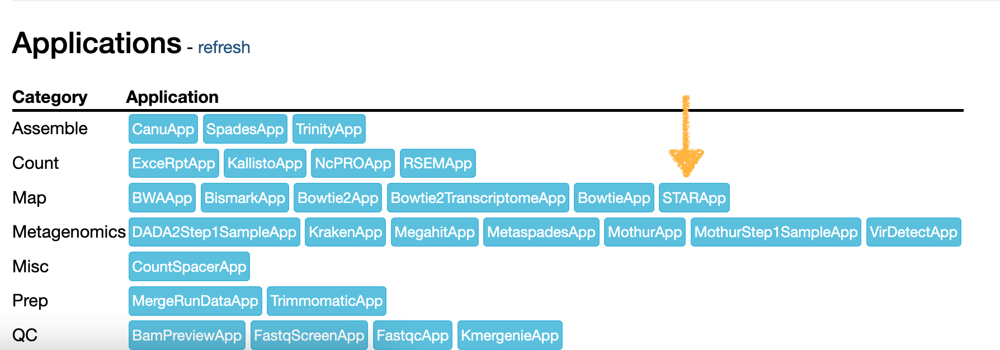
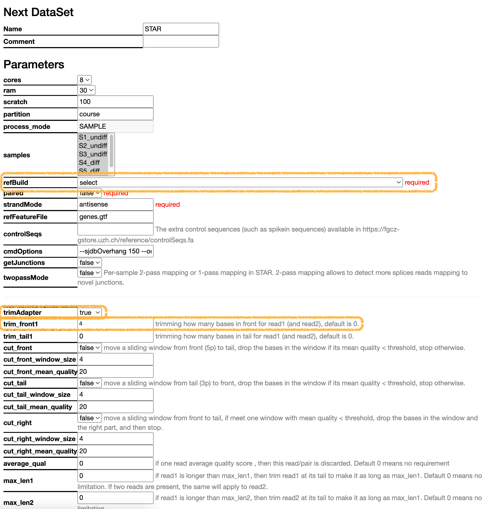
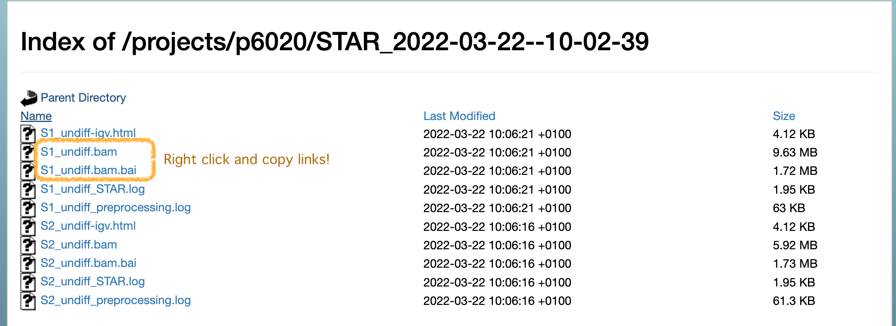
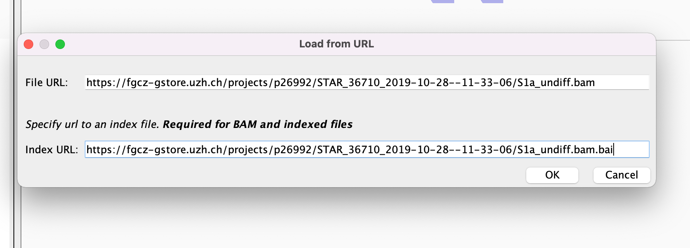
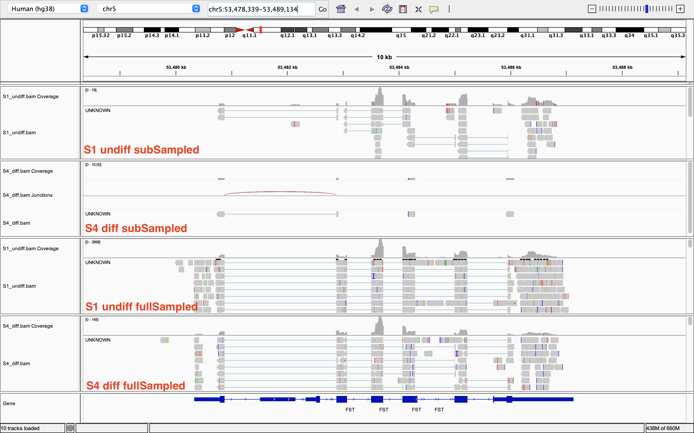
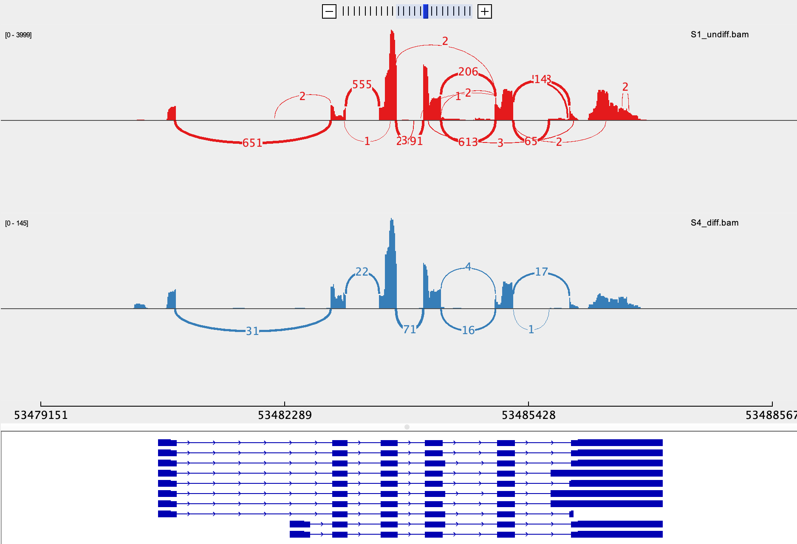

# Exercise 2 - Read Mapping and IGV
- Author: FGCZ
- Date: 26/04/2024

Steps
1. [Navigate back to the FastQC dataset](#1-navigate-back-to-the-fastqc-dataset-in-sushi)
2. [Select parameters](#2-select-some-required-parameters-and-preprocessing-options)
3. [Submit the jobs](#3-submit-the-jobs)
4. [Download and install IGV](#4-download-and-install-igv-on-your-computer)
5. [Open IGV](#5-open-igv)
6. [Load the BAM files into IGV](#6-load-the-bam-files-into-igv)
7. [Questions](#7-questions)

----

### 1. Navigate back to the FastQC dataset in SUSHI

Look at the `map` applications available. Select `STARApp`

### 2. Select some required parameters and preprocessing options 

You will need a `refBuild` reference genome at the very least. We will use **Homo_sapiens/GENCODE/GRCh38.p13/Annotation/Release_37-2021-05-04**

Ensure the other options such as `paired` and `strandMode` are correct (these are automatically selected by SUSHI but still require double-checking!) 

Take a look at the `fastp` preprocessing parameters at the bottom. Do we want to trim some of the front bases off? Maybe we can change `trim_front1` to 4. 

### 3. Submit the jobs 

Click `Next`, check again your chosen parameters, then `Submit`

### 4. Download and install IGV on your computer 

URL: https://software.broadinstitute.org/software/igv/download 

Should include Java as required. 

### 5. Open IGV 

Download the correct reference, which in our case, is **Human (hg38)**. If you can't see it on the list, click "More". 

### 6. Load the BAM files into IGV 

You can load from URL by pasting the link from SUSHI of the BAM and the BAM index (`.bai`) file. Get these links from the data folder in STAR dataset. Load samples `S1_undiff` and `S4_diff`, so we have one from each condition. 

#### **BUT!** 

It is probably best to load the full BAM files, to see how a real big dataset might look. Use some of the links below instead!

S1_undiff:

* https://fgcz-course1.bfabric.org/projects/p9999/STAR_2025-11-24--18-46-28/S1_undiff.bam

* https://fgcz-course1.bfabric.org/projects/p9999/STAR_2025-11-24--18-46-28/S1_undiff.bam.bai

S4_diff

* https://fgcz-course1.bfabric.org/projects/p6000/STAR_2025-11-24--18-46-28/S4_diff.bam

* https://fgcz-course1.bfabric.org/projects/p6000/STAR_2025-11-24--18-46-28/S4_diff.bam.bai

You will probably need to enter your B-Fabric credentials. 

### 7. Questions 

- **Question 1**: What is the gene model? Do our reads map to the right part of the gene? (Hint: Take a look at the annotation track at the bottom, You can search *FST* gene at the box left side to the "Go" button)

- **Question 2**: Is the gene expressed in samples from both conditions?

- **Question 3**: Is there a difference in the read coverage between samples from both conditions? (Hint: Take a look at the number of reads in the coverage track)

- **Question 4**: How many isoforms are identified? (Hint: You can open **Sashimi plot** by right click menu)

- **Question 5**: Look at the splice junctions, which isoforms are present almost exclusively in one sample? Which sample?

Next: [Exercise3 Feature Counts](Exercise_3.md)
