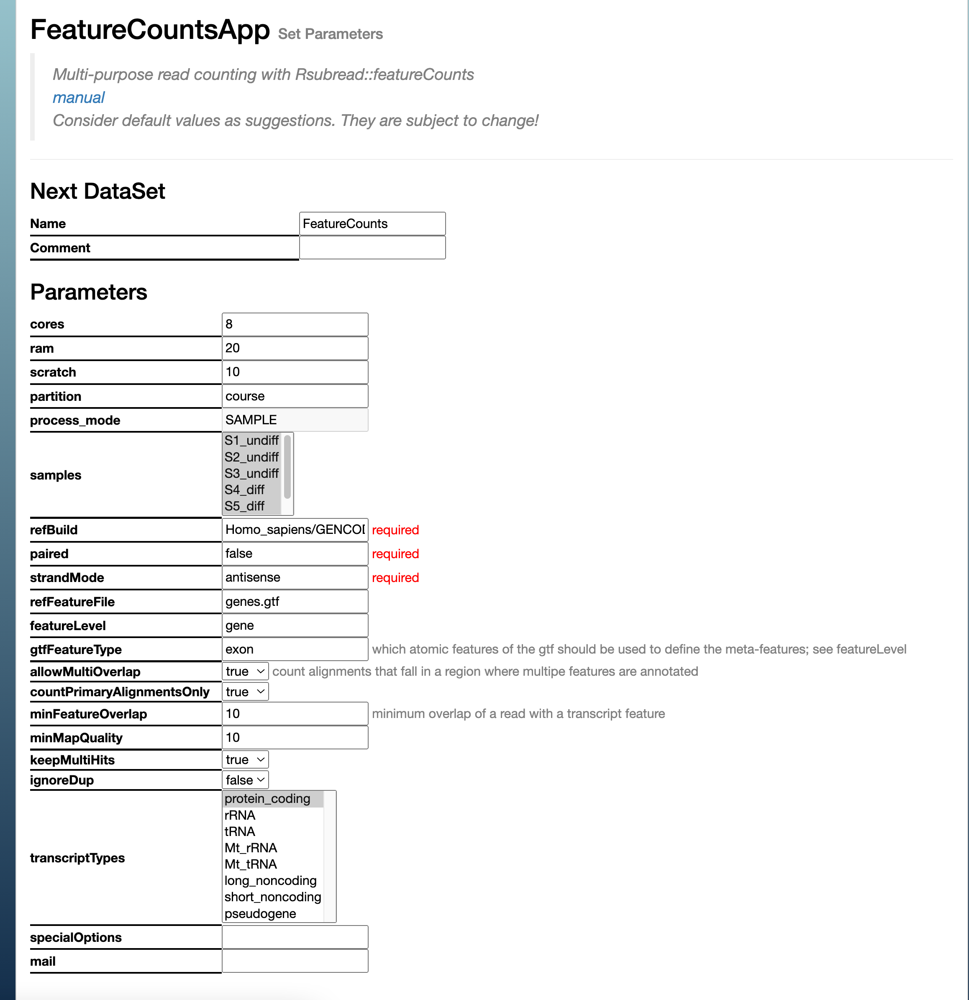
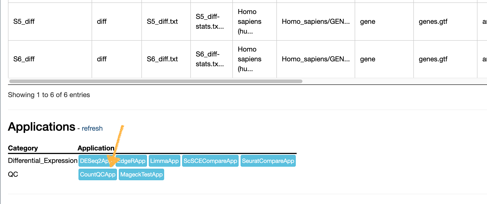
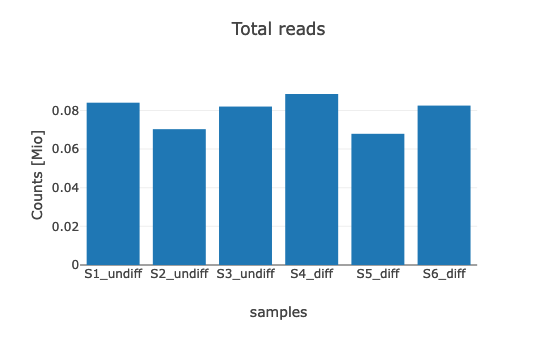
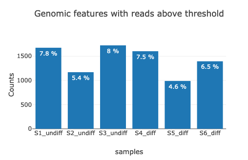
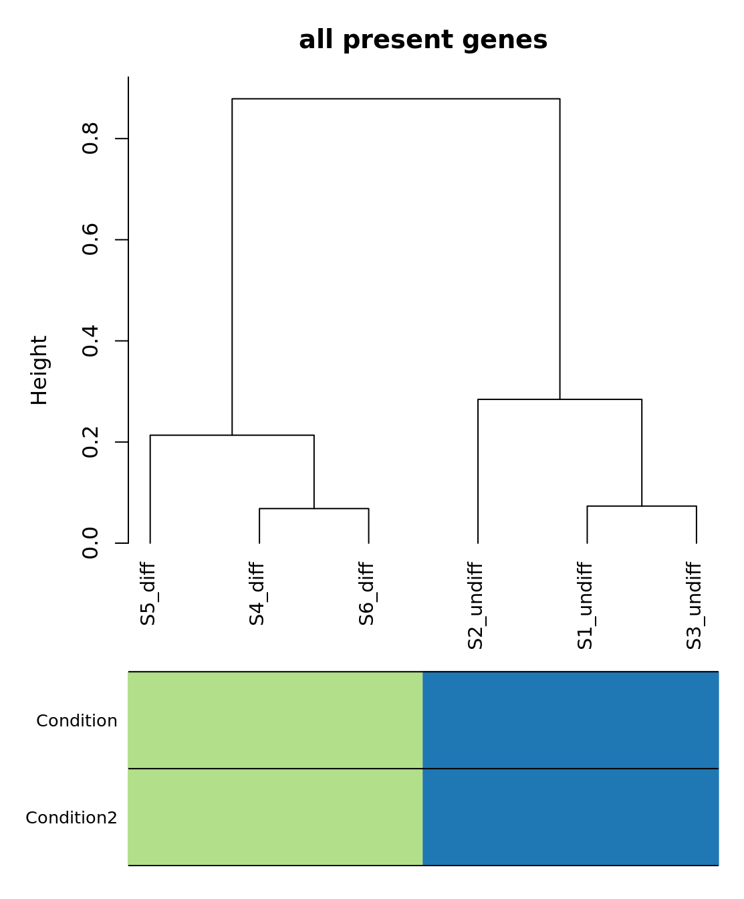
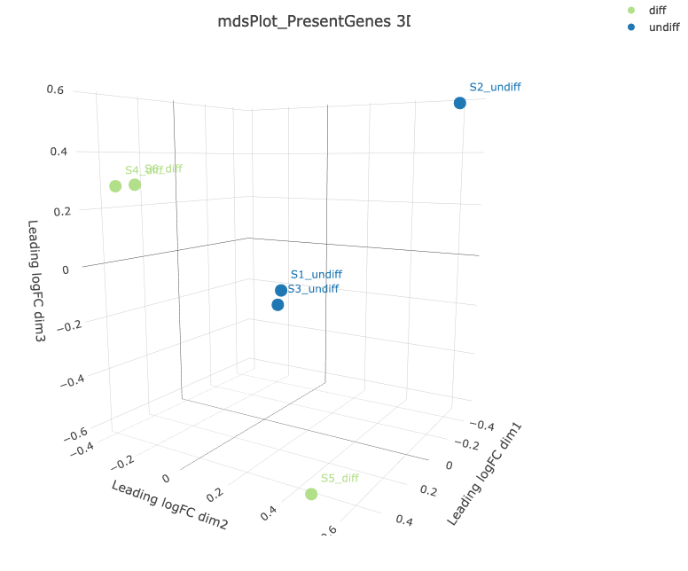

# Exercise 3 - Feature Counts
- Author: FGCZ
- Date: 26/04/2024

Steps
1. [Head to the STAR dataset](#1-head-to-the-star-dataset-in-sushi)
2. [Run CountQC](#2-run-countqc-on-the-resulting-featurecounts-dataset)
3. [Explore the CountQC Static Report](#3-explore-the-countqc-static-report)

----

### 1. Head to the STAR dataset in SUSHI

From the `Count` application list, select `FeatureCountsApp`. Check the settings, the defaults should be fine. 

Options
* Here, you can exclude certain samples by holding the `Command` or `Control` key (Mac/Windows respectively) and clicking samples to include. 
* We can also exclude multi-mapped reads here if you desire *exact* mapped reads (unnecessary in nearly all bulk RNA seq runs). You can also selet multiple transcript types here, *e.g.*, if you have total RNA seq data (like ribo-depleted as opposed to poly-A selected). 

### 2. Run CountQC on the resulting FeatureCounts dataset 

### 3. Explore the CountQC Static Report

#### General QC

- **Question 1**: How many reads are in our final CountQC report, compared with our initial FastQC report? 

- **Question 2**: How many features (in %) are above the threshold? 

- **Question 3**: How best to proceed with underrepresented libraries? Generate more reads, or exclude them? 

#### Sample and gene clustering 

- **Question 4**: How do the samples cluster in the dendrogram? 

- **Question 5**: Are there any outliers? Would you retain or exclude these from downstream analysis? 

- **Question 6**: Are there any biologically-relevant gene clusters? (Hint: Look at the clustering of high variance features. Rows represent genes, columns are samples.)

- **Question 7**: Look at the multidimensional scaling (MDS) plots. How are the samples separated along the three dimensions? 

Next: [Exercise4 Differential Expression](Exercise_4.md)
