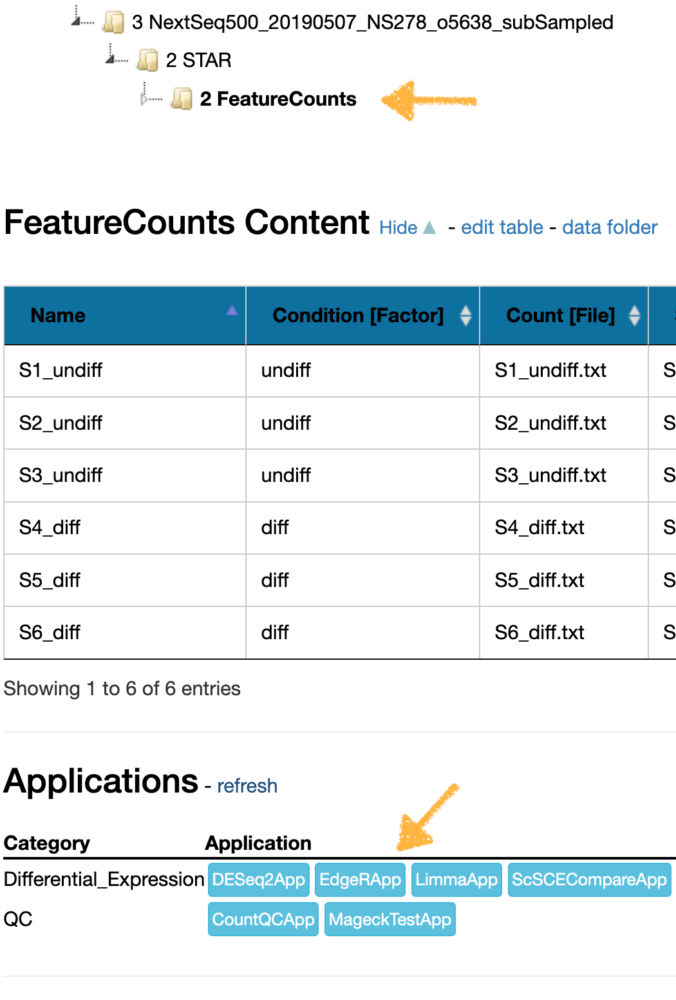
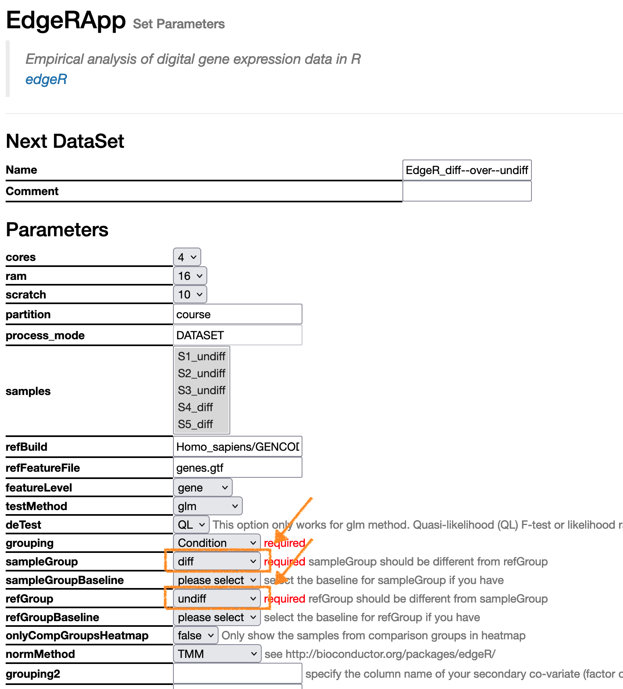

# Exercise 4 - Differential Expression
- Author: FGCZ
- Date: 26/04/2024

Steps
1. [Execute EdgeRApp](#1-from-the-featurecounts-dataset-on-sushi-select-the-edgerapp)
2. [Open the Static Report](#2-once-edger-is-finished-open-the-static-report-of-the-results)
3. [Explore the Static Report](#3-explore-the-static-report)

----

### 1. From the FeatureCounts dataset on SUSHI, select the `EdgeRApp` 

Run the differential gene expression test as `diff` vs `undiff`, so **sampleGroup = diff** and **refGroup = undiff**. 

Leave all other options the same. This will compare differentiated vs undifferentiated cells. 

### 2. Once edgeR is finished, open the Static Report of the results 

### 3. Explore the Static Report 

* [Questions RNAseq exercise4](https://fgcz-shiny.uzh.ch/SUSHI_course_2023/RNAseq/exercise4/)
